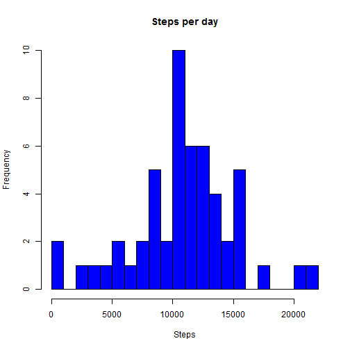
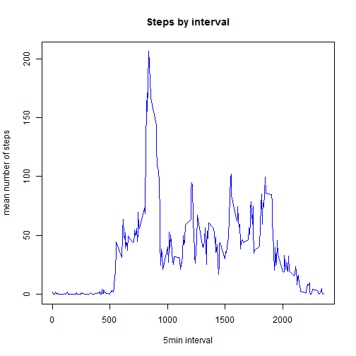
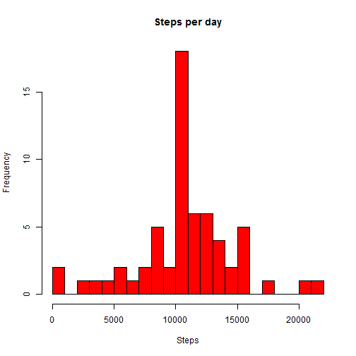
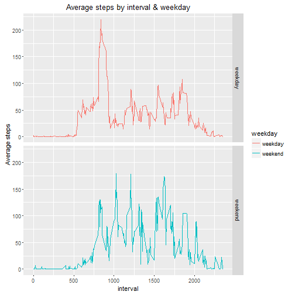

Reproducible Research: Peer Assessment 1
=======================================================

##Loading and preprocessing the data

In this section the code reads the "activity.csv" and creates the "data" data frame.

This data frame contains the three variables of the activity.csv:

* dates: transformed by as.Date
* steps: removed NA values
* interval


```r
activity.csv <- unzip("activity.zip")
activity <- read.csv(activity.csv, header = T)
dates <- as.Date(activity[,2], "%Y-%m-%d", tz = UTC)
df <- data.frame(dates, activity[,1], activity[,3])
colnames(df) <- c("dates", "steps", "interval")
rmNA <- is.na(df[,2])
data <- df[rmNA==FALSE,]
str(data)
```

```
## 'data.frame':	15264 obs. of  3 variables:
##  $ dates   : Date, format: "2012-10-02" "2012-10-02" ...
##  $ steps   : int  0 0 0 0 0 0 0 0 0 0 ...
##  $ interval: int  0 5 10 15 20 25 30 35 40 45 ...
```

##What is mean total number of steps taken per day?

This code uses the dplyr package to group the data by dates and create the steps_day in which the steps variable contains the sum of steps which was measured each day.

Consecutively, it creates a histogram of the number of steps for each day.

The last two lines of code compute the mean and the median respectively, of the total number of steps taken each day.


```r
library(dplyr)
```

```
## Warning: package 'dplyr' was built under R version 3.2.3
```

```
## 
## Attaching package: 'dplyr'
## 
## The following objects are masked from 'package:stats':
## 
##     filter, lag
## 
## The following objects are masked from 'package:base':
## 
##     intersect, setdiff, setequal, union
```

```r
days <- group_by(data, dates)
steps_day <- summarise(days, steps = sum(steps))
hist(steps_day$steps, xlab = "Steps", main = "Steps per day", breaks =20, freq = T, col = "blue")
```

 

```r
mean(steps_day$steps)
```

```
## [1] 10766.19
```

```r
median(steps_day$steps)
```

```
## [1] 10765
```

##What is the average daily activity pattern?

The code groups the data by interval and computes the mean of steps by interval which is stored in "steps_int".
Finally, it plots the average number of steps by interval and shows the interval with the maximum average number of steps.


```r
library(dplyr)
min <- group_by(data, interval)
steps_int <- summarise(min, mean = mean(steps))
plot(steps_int$interval, steps_int$mean, type = "l", col = "blue", xlab = "5min interval", ylab = "mean number of steps", main = "Steps by interval")
```

 

```r
steps_int[steps_int$mean == max(steps_int$mean),]
```

```
## Source: local data frame [1 x 2]
## 
##   interval     mean
##      (int)    (dbl)
## 1      835 206.1698
```

##Imputing missing values

In order to impute the missing values, the code subsets the rows that contain NA values in the steps variable.
It then calculates the rows in order to show the number of missing values.

Finally, it uses the summarize function to find a pattern for the missing values according to the days.


```r
NAs <- df[is.na(df$steps),]
nrow(NAs)
```

```
## [1] 2304
```

```r
summarise(group_by(NAs, dates), count = n())
```

```
## Source: local data frame [8 x 2]
## 
##        dates count
##       (date) (int)
## 1 2012-10-01   288
## 2 2012-10-08   288
## 3 2012-11-01   288
## 4 2012-11-04   288
## 5 2012-11-09   288
## 6 2012-11-10   288
## 7 2012-11-14   288
## 8 2012-11-30   288
```

As it is shown above the missing values correspond to whole days of missing measurements and consequently I decided to impute the missing values of each day using the mean number for each 5min interval as it was calculated in the steps_int variable.

The code merges by interval the NAs and mean number of steps. It also combines the data (containing the initial values) and the imputed data into a new variable "imdata".

Finally, it creates an histogram and calculates the mean and the median.


```r
library(dplyr)
imNAs <- merge(NAs, steps_int, by.x = "interval")
imNAs <- imNAs[,-3]
colnames(imNAs) <-  c("interval", "dates", "steps")
imdata <- rbind(data, imNAs)
imdata <- arrange(imdata, dates)
days <- group_by(imdata, dates)
steps_day <- summarise(days, steps = sum(steps))
hist(steps_day$steps, xlab = "Steps", main = "Steps per day", breaks =20, freq = T, col = "red")
```

 

```r
mean(steps_day$steps)
```

```
## [1] 10766.19
```

```r
median(steps_day$steps)
```

```
## [1] 10766.19
```

We observe that there is no difference of the mean and median with and without the missing values.

#Are there differences in activity patterns between weekdays and weekends?

The code initially uses the weekdays() function to create the day variable using the imputed data.
It then creates the two level weekday variable and combines it in the week_data data frame.
Using the dplyr package groups the data by interval and weekday and applies the mean() function on the steps column by interval.
Finally, using the ggplot library creates the plot of average number of steps for each  5min interval by weekday or weekend.


```r
library(dplyr)
Sys.setlocale("LC_TIME", "English")
```

```
## [1] "English_United States.1252"
```

```r
day <- weekdays(imdata$dates)
weekday <- ifelse(day %in% c("Satarday", "Sunday"), "weekend", "weekday")
week_data <- data.frame(imdata, weekday)
week_int <- group_by(week_data, weekday, interval)
week_mean<- summarise(week_int, mean = mean(steps))
library(ggplot2)
```

```
## Warning: package 'ggplot2' was built under R version 3.2.3
```

```r
g <- ggplot(week_mean, aes(x = week_mean$interval, y = week_mean$mean))
g + geom_line(aes(color =  weekday)) + facet_grid(weekday ~.) + labs(title = "Average steps by interval & weekday", x = "interval", y = "Average steps")
```

 
